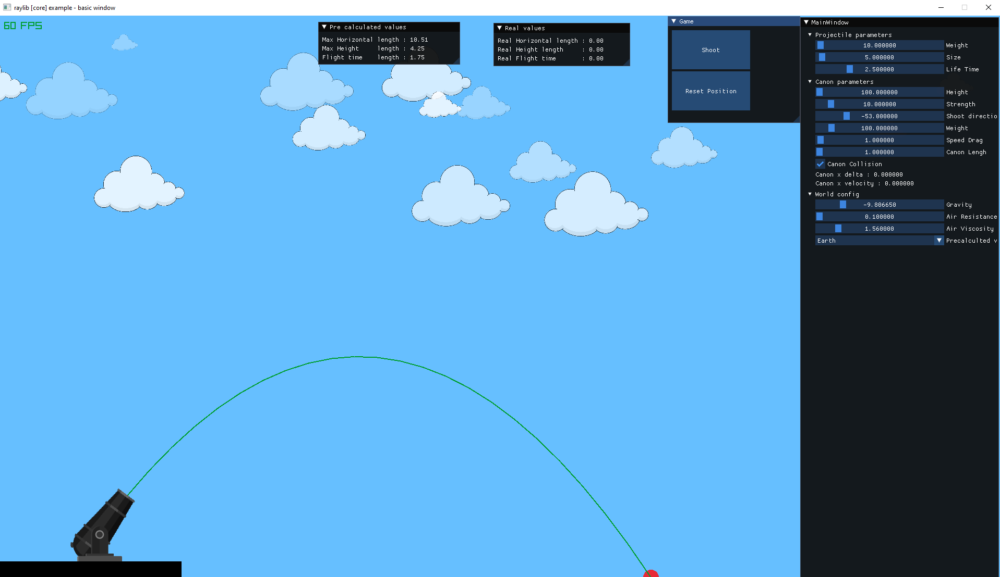
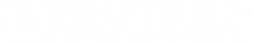
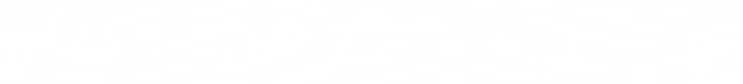
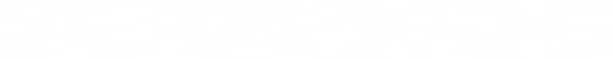
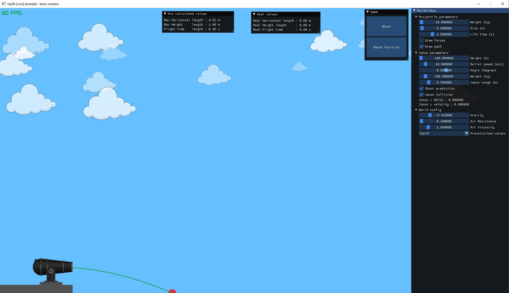
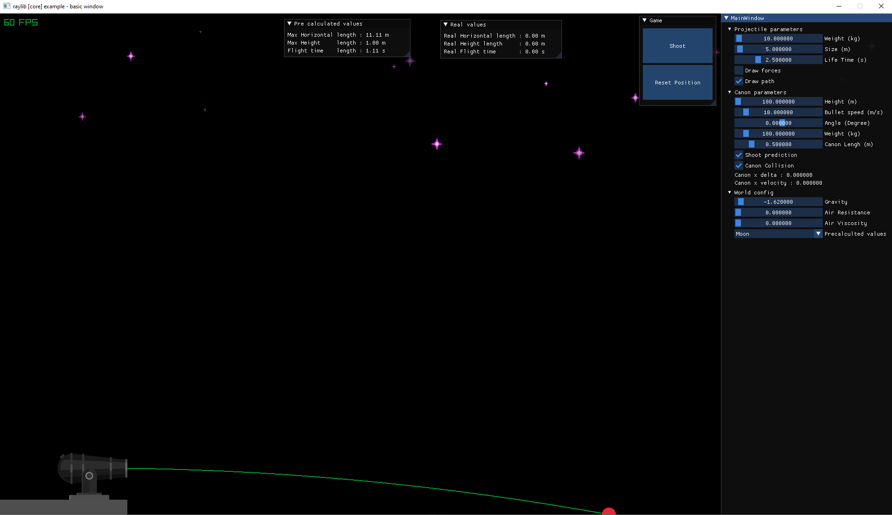
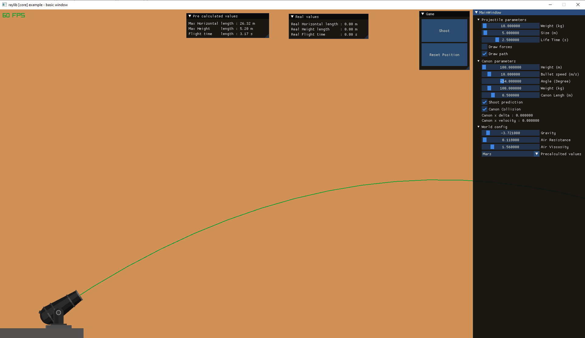
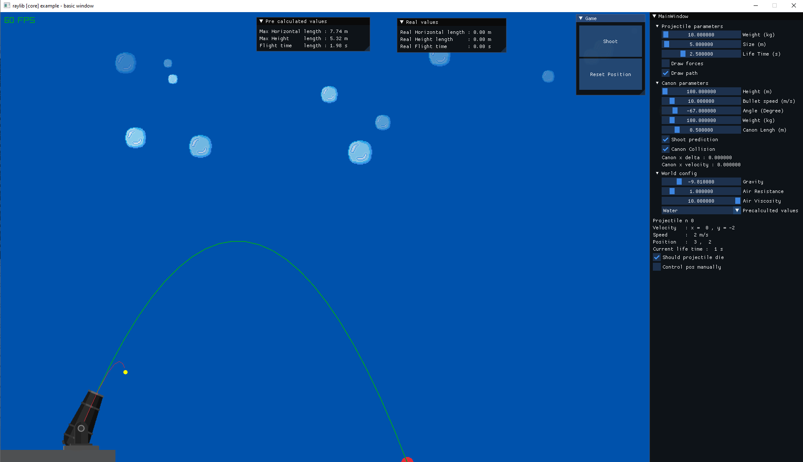

<html>
<link  href="style.css" rel="stylesheet">

<h1> TP : Canon Projet </h1>
<h2> Groupe : </h2>  

    <ul>
        <li>Emma Massauteau
        <li>Bruno Gomes
        <li>Bryan Bachelet
    </ul>

<h2> 1. Introduction : </h2>

    

Pour ce projet de physique, l'objectif était d'implémenter un canon qui propulse un balle. Nous devions appliqué sur ce projectile les équations de mouvement cinématiques dans un premier temps. La suite était d'implémenter un frottement du canon sur la balle puis celui de l'air et enfin d'applique la collision entre le canon et la balle lors du tir.
 

    

    

    <h2> 2. Trajectoire Cinematique :</h2>
    

        

            Pour l'implémentation de la trajectoire cinématique à notre balle, nous d'abord mis en place les équations de mouvement classique puis nous avons appliquer la méthode de l'Euler fait pour l'implémentation numérique afin de résoudre par approximation des équations différentielles du premier ordre avec un condition initiale. Voici la méthode d'Euler : <a href = "https://fr.wikipedia.org/wiki/M%C3%A9thode_d%27Euler"> ici </a>
        

        

            
 
                
            

            
        

    

    <h2> 3. Frottement du Canon</h2>
    

        

        Pour le frottement de canon, nous avons appliqué un frottement de solide contre solide en utilisant le coffecient de Acier / Acier qui de 0.2 afin de modifier la vitesse initiale de notre projectile.
        <ul>
        <li> Longueur du canon : Delta x
        <li> Vitesse initiale : V&#7522;
        </ul>
        

        

            
        

    

    <h2> Frottement l'air : </h2>
    

        Pour le frottement de l'air,
    

    

    
    
    

<h2> Collision du canon </h2>  
 

        

            Pour la collision du canon avec la balle, on applique une collision inélastique sur le canon et un frottement solide contre solide pour le ralentir après le tir. 
        

    

        
    

<h2> Features Additionnels : </h2>

Nous avons ajouté la possibilité de changer le type d'environement dans lequel s'effectue la simulation. Il est possiblie de choisir entre la Terre, la Lune, Mars ou encore dans de l'eau. Lorsque vous choissiez un de ces quatres environnement, les paramètres du monde vont être changer pour correspondre à l'environnement sélectionné.

        
        
        
        
    

<h2> Crédits : </h2>
Pour réaliser ce projet, nous avons utilisé plusieurs librairies : 
<ul>
    <li> Raylib 
    <li> Dear ImGUI
</ul>

</body>
</html>

